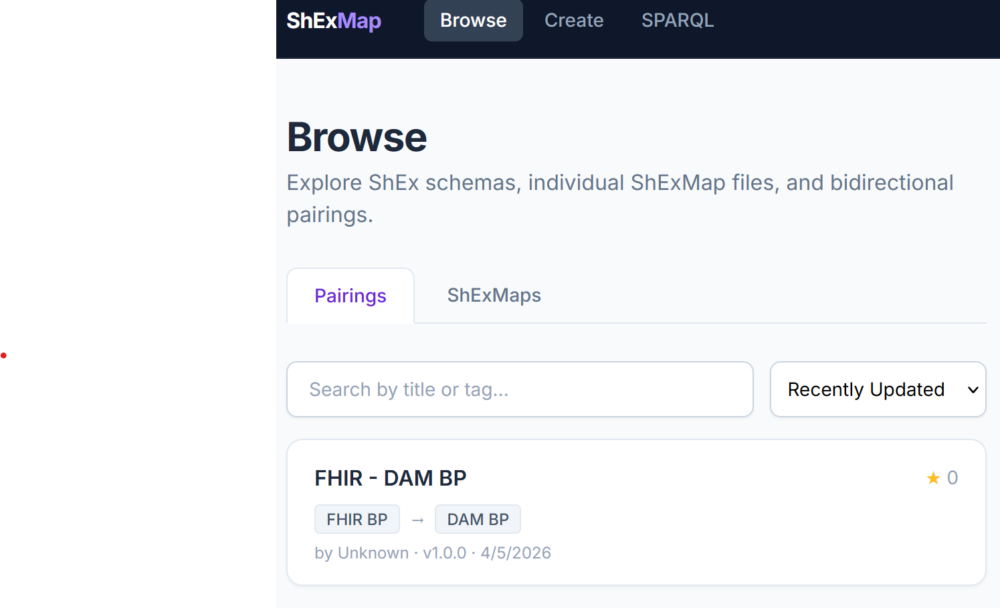
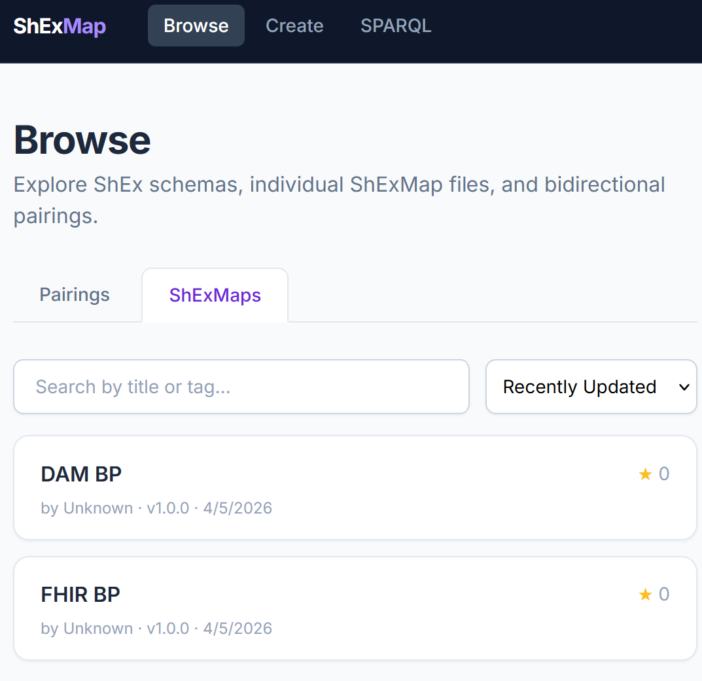

# ShExMap Repository

An online platform to store, discover, and explore **ShExMaps** — mappings between RDF shapes defined by [ShEx (Shape Expressions)](http://shex.io).

#### Edit a pair of ShExMap files at the same time.


#### Keep track of the overlap between variables


#### Validate sample data against the ShExMap


#### Transform RDF data conforming to one schema, into another


#### Save the ShExMap pairing into the repository


### Search and browse pairings and ShExMaps

| | |
|---|---|
|  |  |

## Features

- **REST API** (`/api/v1/`) with OpenAPI documentation at `/api/v1/docs`
- **SPARQL 1.1 endpoint** (`/sparql`) backed by [QLever](https://github.com/ad-freiburg/qlever)
- **React web interface** — browse, search, submit, and visualise ShExMaps
- **Pairing editor** — side-by-side ShEx authoring with per-side validation, shared variable highlighting, and paired validate/materialise
- **Optional authentication** — OAuth2/OIDC (GitHub, ORCID, Google) + API keys; disabled by default

## Quick Start

```bash
git clone <repo>
cd shexmap-repository

cp .env.example .env        # review and edit as needed
docker compose up --build -d
```

Open [http://localhost](http://localhost).

- REST API docs: [http://localhost/api/v1/docs](http://localhost/api/v1/docs)
- SPARQL endpoint: [http://localhost/sparql](http://localhost/sparql)

## Tech Stack

- **Backend**: Node.js + Fastify (TypeScript)
- **Triplestore**: QLever
- **Frontend**: React + Vite + Tailwind CSS
- **Visualisation**: ReactFlow, Recharts
- **Deployment**: Docker + Docker Compose

## Development

QLever must be running locally before starting the API or frontend. Start it with Docker Compose (detached), then run the API and frontend dev servers:

```bash
# 1. Start QLever in the background (only needed once)
docker compose up qlever-init qlever -d

# 2. Set up the .env and symlink it for the API
cp .env.example .env        # uses localhost:7001 for QLever
ln -s ../.env api/.env

# 3. API with hot reload
cd api && npm install && npm run dev

# 4. Frontend dev server (with HMR) — in a separate terminal
cd frontend && npm install && npm run dev
```

Open [http://localhost:5173](http://localhost:5173).

The Vite dev server proxies `/api` → `localhost:3000` and `/sparql` → `localhost:7001`.

## Configuration

All configuration is via environment variables. Copy `.env.example` to `.env`.

| Variable | Default | Description |
|----------|---------|-------------|
| `AUTH_ENABLED` | `false` | Enable OAuth2/OIDC authentication |
| `QLEVER_SPARQL_URL` | `http://localhost:7001/sparql` | QLever SPARQL endpoint |
| `JWT_SECRET` | *(change this)* | Secret for signing JWTs |

## Creating a Pairing

Navigate to `/pairings/create` (or click **Create Pairing** in the nav).

1. **Select ShExMaps** — pick a source and target ShExMap from the dropdowns, or create new ones inline. The latest saved version of each map is loaded automatically.
2. **Edit ShEx & sample data** — each side has a Monaco ShEx editor and a Sample Turtle Data editor. Turtle data and the focus IRI are saved to browser localStorage per map and restored on next visit.
3. **Validate per side** — click **Validate** in the Focus IRI row of either panel to check that the ShEx extracts bindings from the sample data. Results appear inline below the editor.
4. **Paired validation** — use section 3 to validate across both sides. Choose a direction (Source→Target or Target→Source), then **Validate** to extract bindings or **Validate & Materialise** to also generate target RDF.
5. **Save** — fill in the pairing metadata (title, tags, version, license) and click **Save Pairing**. On subsequent edits, an optional change note can be entered before clicking **Update Pairing**, which saves metadata and creates a version snapshot in one step. Use **↓ Download** to export the pairing as JSON.

## QLever Data Management

QLever stores all ShExMap data as RDF triples in an on-disk index. The index is built once at startup from Turtle files and updated at runtime via SPARQL UPDATE. Three scripts manage the lifecycle of this data.

### Initial setup / index rebuild

The repository starts empty. To pre-populate with seed data, add Turtle files to `sparql/seed/shexmaps/` and `sparql/seed/pairings/` before the first run.

To rebuild the index from the current seed and ontology files (wipes all runtime data):

```bash
./scripts/rebuild-index.sh
```

This stops QLever, wipes the data volume, copies the ontology and all seed Turtle files, rebuilds the index, and restarts QLever.

### Backup

Dump the live triplestore to a Turtle file:

```bash
./scripts/backup-db.sh                          # writes to sparql/backup/YYYY-MM-DDTHH-MM-SS.ttl
./scripts/backup-db.sh my-backup.ttl            # write to a specific file
```

Requires a running QLever instance. The script issues a `CONSTRUCT { ?s ?p ?o } WHERE { ?s ?p ?o }` query and saves the result as Turtle.

### Restore

Rebuild the QLever index from a previously saved backup:

```bash
./scripts/restore-db.sh sparql/backup/2026-01-01T00-00-00.ttl
```

This stops QLever, rebuilds the index from the backup file, and restarts QLever. **Destructive** — the current index is wiped before restore. The script prompts for confirmation before proceeding.


## License

Apache 2.0
